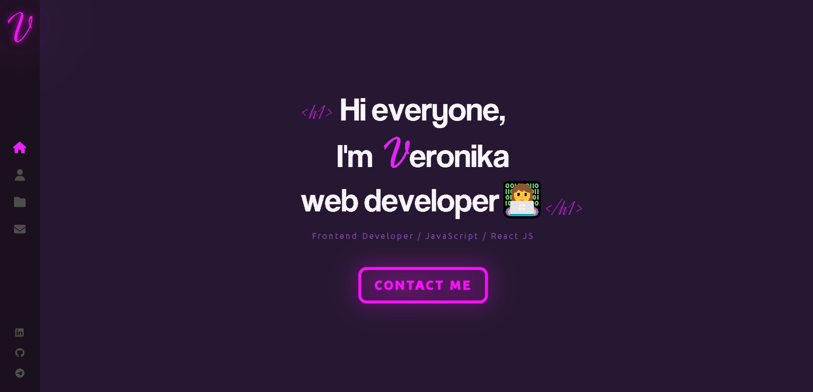

# Website "Potfolio"

This is my portfolio site. I plan to refine it further as I study new technologies.

## Table of contents

- [Overview](#overview)
  - [Information](#information)
  - [Screenshot](#screenshot)
  - [Links](#links)
- [My process](#my-process)
  - [Built with](#built-with)
  - [What I learned](#what-i-learned)

## Overview

### Information

On this site you can find out some information about me, see my works, and also contact me using social networks and messenger.
Alternatively, you can write me an email.

### Screenshot

### Links

- [Live Site URL](https://portfolio-verman.netlify.app/)

## My process

### Built with

- React JS
- react-router-dom
- react-loaders
- SCSS
- Vite
- animate.css
- Email JS
- SweetAlert 2
- Slider Swiper

### What I learned

Using React JS to create SPA sites, connecting and using the animate.css library, connecting and using Email JS.
